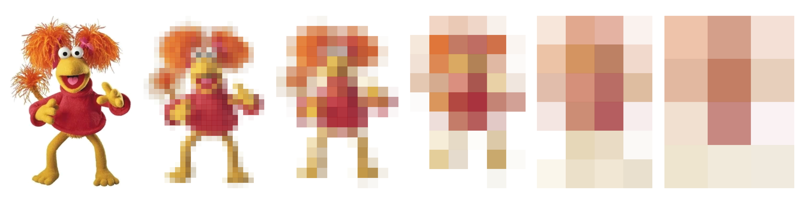
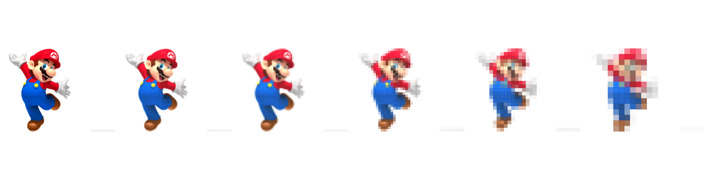

# pixelize

Some silly code to reduce image size by averaging groups of pixels, creating a pixelated effect in the resulting image.

Function `pixelize()` requires an image path and a number of block.

Examples:

```         
image_path <- "images/fraggle.png" 

a<- pixelize(image_path,1)
b<- pixelize(image_path,10)
c<- pixelize(image_path,20)
d<- pixelize(image_path,40)
e<- pixelize(image_path,60)
f<- pixelize(image_path,90)

a+b+c+d+e+f+ plot_layout(ncol = 6)  + 
  theme(plot.margin = margin(0, 0, 0, 0))
```



```         
image_path <- "images/mario.jpg" 

a<- pixelize(image_path,1)
b<- pixelize(image_path,10)
c<- pixelize(image_path,20)
d<- pixelize(image_path,40)
e<- pixelize(image_path,60)
f<- pixelize(image_path,90)

a+b+c+d+e+f+ plot_layout(ncol = 6)  + 
  theme(plot.margin = margin(0, 0, 0, 0))
```


